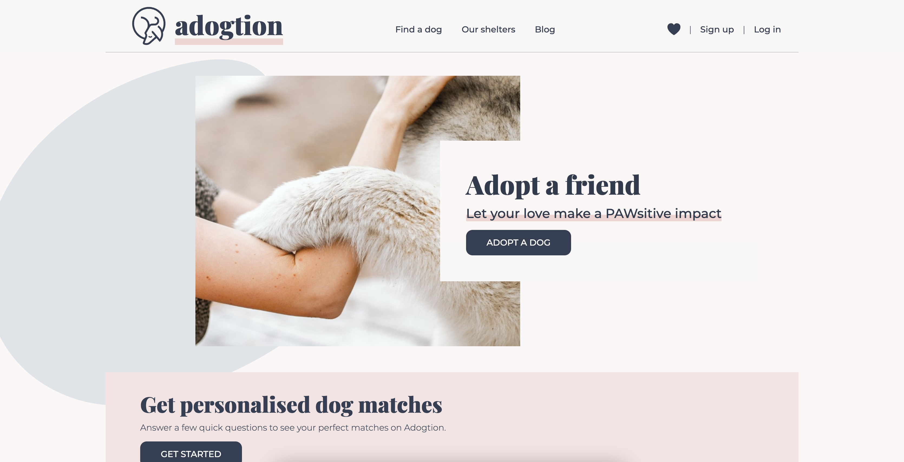
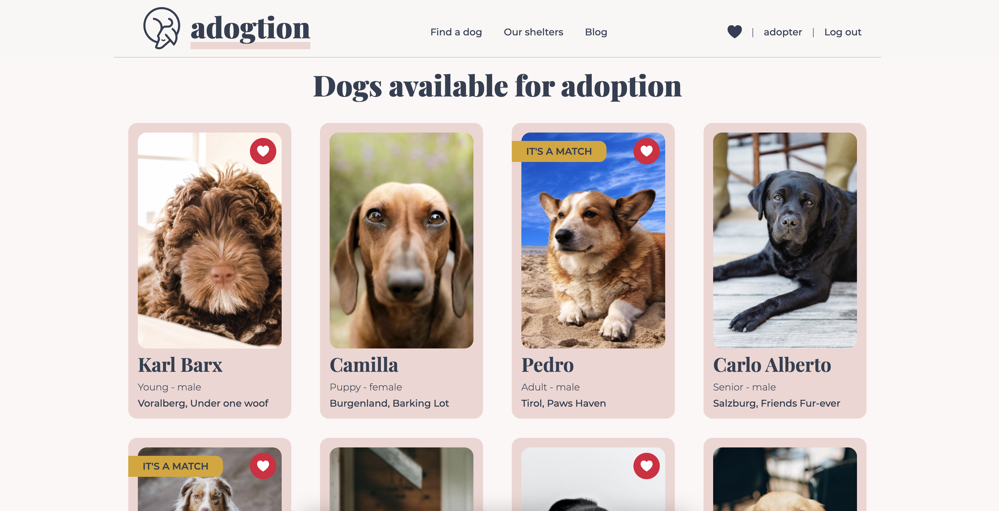
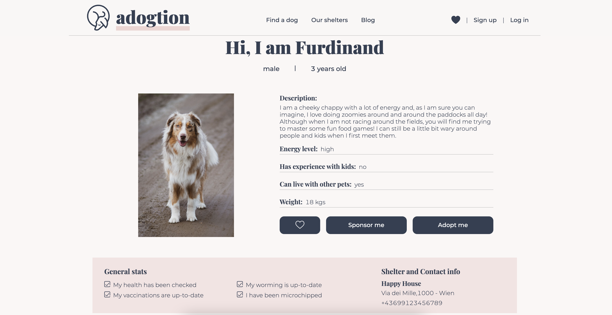

# Adogtion

**Adogtion** is a web app for dog adoption from Austrian shelters and associations. This application will allow users to favourite dogs, adopt dogs, as well as the possibility of supporting them with donations for food, bedding, toys or for vet health checks.
Shelters can edit their information, complete adoptions and add new dogs to the platform.

**Desktop version** : this web app is optimised to be used in resolutions with a width bigger than 1680px.

Deployed version: https://adogtion.fly.dev/

## Technologies used

**Client:** Next.js, React, TypeScript, Styled Components, Jest

**Server:** Node.js, PostgreSQL

## Screenshots

### Landing page



### Dogs overview for a logged in user



### Individual dog description



## Setup guide

To run this project locally, the following steps are needed:

1. Clone this repo on your local machine and connect to your GitHub account

2. Download and install PostgreSQL (if not installed yet).

- https://www.postgresql.org/download/

3. Create a User and a Database for the project.

4. Create a copy of the `.env.example` and name it `.env` on the root of the project and modify it with your PostgreSQL credentials. The file should include these four environment variables:

```
PGHOST=localhost
PGDATABASE=<YOUR_POSTGRES_DATABASE>
PGUSERNAME=<YOUR_POSTGRES_USERNAME>
PGPASSWORD=<YOUR_POSTGRES_PASSWORD>
...
```

5. Create a Cloudinary account and use the credentials for Image Uploads.

6. Add the next environment variables to your .env file

```
...
BASE_URL=<YOUR_API_URL>
CSRF_SECRET=<CRSF_SALT_KEY>
```

7. Install the dependencies

```bash
$ yarn
```

8. Install dotenv-cli globally with:

```bash
$ yarn global add dotenv-cli
```

9. In a terminal window start PostgreSQL

```bash
$ postgres
```

10. Run the migrations for your local database with:

```bash
$ yarn migrate up
```

11. Start the application with:

```bash
$ yarn dev
```
